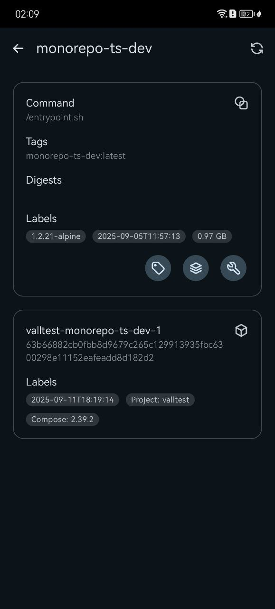

# Whalya (/ˈwɑːl.jə/)

 

## Screenshots (2025-09-15)

| Multiple docker host selection                       | Add new docker host                                        | App settings                                           |
| ---------------------------------------------------- | ---------------------------------------------------------- | ------------------------------------------------------ |
|  |  |  |

| Host system overview                                       | Remove Unused Data                                                         | List containers                                                    |
| ---------------------------------------------------------- | -------------------------------------------------------------------------- | ------------------------------------------------------------------ |
|  |  |  |

| Inspect container                                                          | Supported container operations                                                                           | Container logs                                                                       |
| -------------------------------------------------------------------------- | -------------------------------------------------------------------------------------------------------- | ------------------------------------------------------------------------------------ |
|  |  |  |

| Live container stats                                                                             | List images                                                | Inspect image                                                      |
| ------------------------------------------------------------------------------------------------ | ---------------------------------------------------------- | ------------------------------------------------------------------ |
|  |  |  |

| Supported image operations                                                                       | View image labels                                                                | View image layers                                                                |
| ------------------------------------------------------------------------------------------------ | -------------------------------------------------------------------------------- | -------------------------------------------------------------------------------- |
|  |  |  |

| List networks                                                  | Inspect network                                                        | Supported network operations                                                                         |
| -------------------------------------------------------------- | ---------------------------------------------------------------------- | ---------------------------------------------------------------------------------------------------- |
|  |  |  |

| List volumes                                                 | Inspect volume                                                       | Supported volume operations                                                                        |
| ------------------------------------------------------------ | -------------------------------------------------------------------- | -------------------------------------------------------------------------------------------------- |
|  |  |  |

## Supported Versions

Android 11 ~ 16

## Credits

- [tabler/tabler-icons](https://github.com/tabler/tabler-icons.git)
